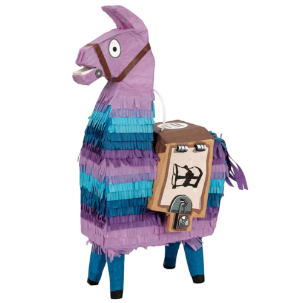

<h1 align="center">
   
  
   
</h1>

<h3 align="center">
  GGMLCS
</h3>

### Models
Verfied Models on current state of the project

|  Model  |
| ------- |
|  [LLama2](https://huggingface.co/TheBloke/llama-2-7B-Guanaco-QLoRA-GGUF) |
|  [TinyLLama](https://huggingface.co/TheBloke/TinyLlama-1.1B-Chat-v1.0-GGUF/tree/main)  |

### TODO
- [ ] Plain models installer
- [ ] HF models installer
- [ ] LLama.cpp builder
- [ ] GGML Converter
- [ ] Binding GGML
- [ ] GPT-2 Binding
- [x] Binding LLAMA
- [ ] Quantization support
- [ ] Serve as server
- [ ] Serve concurrent users
